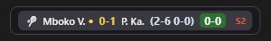

#  Sports Overlay


A compact, always-on-top score bar for Windows that shows your starred FlashScore games right on your desktop. No need to keep switching tabs to check scores.


<!-- TODO: replace with an actual screenshot once you take one -->

## How it works

The app scrapes your starred games from FlashScore and displays them as small "pill" chips floating over your taskbar (or docked to the top/bottom of the screen). Scores update every few seconds, and you get a sound notification when someone scores.

There are two ways to get data in:

1. **Built-in browser** (default) — the app opens a hidden FlashScore window using WebView2, scrapes your favourites automatically, and you never need to touch a browser.
2. **Browser extension** — install the included Chromium extension in Opera GX, Chrome, or Edge. It connects to the app over a local WebSocket and streams scores from any open FlashScore tab.

## Supported sports

Football, tennis, basketball, hockey, baseball, handball, volleyball, rugby, cricket, darts, snooker, boxing/MMA, table tennis, badminton, e-sports, motorsport, and more. Each sport gets its own icon and display style (set scores for tennis, period scores for basketball, etc.).

## Getting started

### Requirements

- Windows 10 or 11
- [.NET 9 SDK](https://dotnet.microsoft.com/download/dotnet/9.0)
- [WebView2 Runtime](https://developer.microsoft.com/en-us/microsoft-edge/webview2/) (comes pre-installed on most Windows 10/11 machines)

### Run it

```powershell
cd SportsOverlayApp
dotnet run
```

The app starts minimized to the system tray with an **S** icon. Right-click the tray icon for all options.

### Pick your games

1. Right-click the tray icon → **Choose Games (FlashScore)**.
2. A FlashScore window opens. Log in if you want your favourites synced, then star the games you want to follow.
3. Close the window — the app keeps scraping in the background.

## Browser extension (optional)

If you prefer streaming scores from your own browser tab instead of the built-in one:

1. Make sure the desktop app is running.
2. Go to `opera://extensions`, `chrome://extensions`, or `edge://extensions`.
3. Turn on **Developer mode**.
4. Click **Load unpacked** and pick the `extension/` folder.
5. Open FlashScore in a tab and star the games you care about.

The extension popup lets you toggle streaming on/off and change the WebSocket port (default: `8787` — make sure it matches in Settings).

## Settings

Right-click the tray icon → **Settings**. You can change:

| Option | What it does |
|--------|-------------|
| Data source | Built-in FlashScore browser vs. browser extension |
| Bar position | Taskbar overlay, bottom of screen, or top of screen |
| Theme | Dark or light |
| Opacity | How transparent the overlay is |
| Goal sound | Sound alert when a score changes |
| Start with Windows | Auto-launch on login |
| WebSocket port | Port for the extension connection |

## Project structure

```
SportsOverlayApp/          .NET 9 WPF app
├── Models/                Data models (GameData, UserPreferences)
├── Services/              WebSocket server, score parser, local cache
├── Resources/             FlashScore scraping script (embedded browser)
├── Utils/                 Notifications, Windows startup
└── Views/                 Overlay window, settings, FlashScore picker
extension/                 Chromium extension (Manifest V3)
├── content.js             Scrapes starred games from FlashScore pages
├── background.js          Updates the toolbar badge with the first score
├── popup.html/js          Extension popup (port config, status)
└── manifest.json          Extension manifest
tools/                     Dev utilities (selector regression test)
```

## Development

The scrapers live or die by FlashScore's CSS selectors. When they break, use the
selector regression test instead of debugging blind in the browser:

```powershell
npm install            # once — pulls puppeteer-core (drives your installed Chrome/Edge)
npm run test:scrape    # scrapes tools/test-row.html and prints the extracted JSON
```

`tools/test-row.html` holds a real match row captured from DevTools. To update it,
right-click a starred row on FlashScore → Inspect → copy outer HTML, paste it into
that file, then run the test and adjust the selectors in **both**
`extension/content.js` and `SportsOverlayApp/Resources/scraper.js`.

To build a standalone exe (no .NET install needed on the target machine):

```powershell
dotnet publish SportsOverlayApp -c Release -r win-x64 --self-contained `
  -p:PublishSingleFile=true -o publish
```

## Known quirks

- **FlashScore changes its HTML regularly.** If scores stop updating, the CSS selectors in `content.js` and `Resources/scraper.js` probably need tweaking.
- **Taskbar overlay mode** floats above the taskbar (not embedded in it) because Windows doesn't support real taskbar embedding for third-party apps anymore.
- **If connection drops**, the app keeps showing the last known scores and marks the status dot as red/offline.

## Contributing

Found a bug or want to add a sport? Open an issue or submit a PR. Keep selector changes in sync between `extension/content.js` and `SportsOverlayApp/Resources/scraper.js` — they use the same parsing logic.

## License

[MIT](LICENSE)
